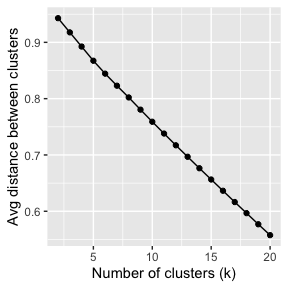
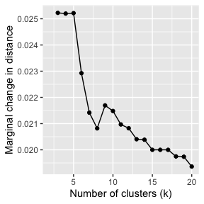
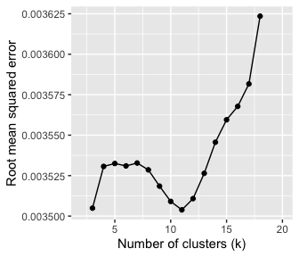
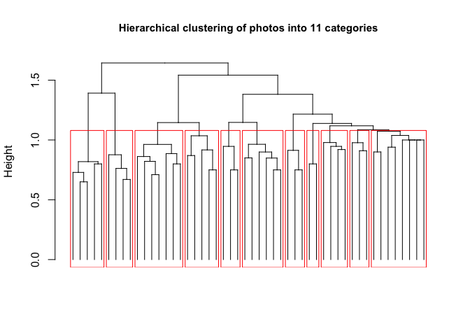

&nbsp;

This tutorial describes the workflow and R code that can be used to classify a large number of images into *discrete* categories, based on their content. The source documents are available on [GitHub](<https://github.com/xp-song/photo-classify>), and the interactive HTML is viewable [here](http://htmlpreview.github.io/?https://github.com/xp-song/photo-classify/blob/master/Photo_classification.html). This tutorial provides supplementary information to the following publication:

&nbsp;

Song, X.P., Richards, D.R., Tan, P.Y. (2020). Using social media user attributes to understand human–environment interactions at urban parks. Scientific Reports (forthcoming). https://doi.org/10.1038/s41598-020-57864-4

An earlier iteration of the code was used in [this publication](https://doi.org/10.1016/j.ecoser.2017.09.004). Note that there are [numerous other ways to classify images](https://doi.org/10.1016/J.ECOLIND.2018.08.035), including those that deal with overlapping content.

&nbsp;

***

The dataset `photos` is used as an example. It contains 50 photos with a column of photo *source* URLs. These are sent to the Google Cloud Vision Application Programming Interface (API), to generate up to ten keyword labels per photo.

Note that you will need to have signed-up with the Google Cloud Platform and generated your Client ID and Client secret. We will be using the [googleAuthR](https://cran.r-project.org/web/packages/googleAuthR/index.html) and [RoogleVision](https://github.com/cloudyr/RoogleVision) packages to interact with the API.

&nbsp;

First few rows of the `photos` dataset:
<table class="table table-striped table-condensed table-responsive" style="margin-left: auto; margin-right: auto;">
 <thead>
  <tr>
   <th style="text-align:left;"> photoid </th>
   <th style="text-align:left;"> url </th>
  </tr>
 </thead>
<tbody>
  <tr>
   <td style="text-align:left;"> 29993180834 </td>
   <td style="text-align:left;"> https://farm6.staticflickr.com/5641/29993180834_8179c87aa7_z.jpg </td>
  </tr>
  <tr>
   <td style="text-align:left;"> 7002246829 </td>
   <td style="text-align:left;"> https://farm7.staticflickr.com/6240/7002246829_d114f402e7_z.jpg </td>
  </tr>
  <tr>
   <td style="text-align:left;"> 5466070643 </td>
   <td style="text-align:left;"> https://farm6.staticflickr.com/5216/5466070643_759428f4a5_z.jpg </td>
  </tr>
  <tr>
   <td style="text-align:left;"> 16303185765 </td>
   <td style="text-align:left;"> https://farm9.staticflickr.com/8571/16303185765_4dd4d48b7b_z.jpg </td>
  </tr>
  <tr>
   <td style="text-align:left;"> 30414187771 </td>
   <td style="text-align:left;"> https://farm6.staticflickr.com/5503/30414187771_5283977ca6_z.jpg </td>
  </tr>
  <tr>
   <td style="text-align:left;"> 16065397248 </td>
   <td style="text-align:left;"> https://farm9.staticflickr.com/8593/16065397248_7a6a0666b1_z.jpg </td>
  </tr>
</tbody>
</table>

&nbsp;

Plug-in your Google Cloud Platform credentials:

```r
require(googleAuthR)

options("googleAuthR.client_id" = "xxx.apps.googleusercontent.com")
options("googleAuthR.client_secret" = "")

options("googleAuthR.scopes.selected" = c("https://www.googleapis.com/auth/cloud-platform"))
googleAuthR::gar_auth() #You will be directed to a weblink to sign-in with your account
```

&nbsp;

***

# Generate Keywords 

Create a loop to send each photo URL to the Google Cloud Vision API, and append the results to `photos`:

```r
require(RoogleVision) 

#add extra columns for 10 x 3 rows of data (keyword, probability score, and topicality score)
photos[,3:32] <- NA

##Loop##
for(i in 1:length(photos$url)){ 

  te <- getGoogleVisionResponse(photos$url[i], feature="LABEL_DETECTION", numResults = 10)
  
  #If not successful, return NA matrix
  if(length(te)==1){ te <- matrix(NA, 10,4)} 
  if (is.null(te)){ te <- matrix(NA, 10,4)}
  
  te <- te[,2:4]
  
  #if successful but no. of keywords <10, put NAs in remaining rows
  if(length(te[,1])<10){
    te[(length(te[,1])+1):10,] <- NA}  
  
  #Append all data!
  photos[i, 3:12] <- te[,1] #keywords
  photos[i, 13:22] <- te[,2] #probability scores
  photos[i, 23:32] <- te[,3] #topicality scores
  
  cat("<row", i, "/", length(photos[,1]), "> ")
  }
```


&nbsp;

Keyword results for the first few rows of the `photos` dataset:
<table class="table table-striped table-condensed table-responsive" style="font-size: 12px; margin-left: auto; margin-right: auto;">
 <thead>
  <tr>
   <th style="text-align:left;"> w1 </th>
   <th style="text-align:left;"> w2 </th>
   <th style="text-align:left;"> w3 </th>
   <th style="text-align:left;"> w4 </th>
   <th style="text-align:left;"> w5 </th>
   <th style="text-align:left;"> w6 </th>
   <th style="text-align:left;"> w7 </th>
   <th style="text-align:left;"> w8 </th>
   <th style="text-align:left;"> w9 </th>
   <th style="text-align:left;"> w10 </th>
  </tr>
 </thead>
<tbody>
  <tr>
   <td style="text-align:left;"> tree </td>
   <td style="text-align:left;"> nature </td>
   <td style="text-align:left;"> vegetation </td>
   <td style="text-align:left;"> sky </td>
   <td style="text-align:left;"> borassus flabellifer </td>
   <td style="text-align:left;"> plant </td>
   <td style="text-align:left;"> palm tree </td>
   <td style="text-align:left;"> woody plant </td>
   <td style="text-align:left;"> arecales </td>
   <td style="text-align:left;"> tropics </td>
  </tr>
  <tr>
   <td style="text-align:left;"> sea </td>
   <td style="text-align:left;"> water </td>
   <td style="text-align:left;"> wave </td>
   <td style="text-align:left;"> ocean </td>
   <td style="text-align:left;"> beach </td>
   <td style="text-align:left;"> square </td>
   <td style="text-align:left;"> calm </td>
   <td style="text-align:left;"> surfing equipment and supplies </td>
   <td style="text-align:left;"> surfboard </td>
   <td style="text-align:left;"> horizon </td>
  </tr>
  <tr>
   <td style="text-align:left;"> bird </td>
   <td style="text-align:left;"> fauna </td>
   <td style="text-align:left;"> beak </td>
   <td style="text-align:left;"> wren </td>
   <td style="text-align:left;"> wildlife </td>
   <td style="text-align:left;"> old world flycatcher </td>
   <td style="text-align:left;"> piciformes </td>
   <td style="text-align:left;"> woodpecker </td>
   <td style="text-align:left;"> twig </td>
   <td style="text-align:left;"> perching bird </td>
  </tr>
  <tr>
   <td style="text-align:left;"> plant </td>
   <td style="text-align:left;"> flora </td>
   <td style="text-align:left;"> leaf </td>
   <td style="text-align:left;"> tree </td>
   <td style="text-align:left;"> NA </td>
   <td style="text-align:left;"> NA </td>
   <td style="text-align:left;"> NA </td>
   <td style="text-align:left;"> NA </td>
   <td style="text-align:left;"> NA </td>
   <td style="text-align:left;"> NA </td>
  </tr>
  <tr>
   <td style="text-align:left;"> sitting </td>
   <td style="text-align:left;"> leg </td>
   <td style="text-align:left;"> fun </td>
   <td style="text-align:left;"> vacation </td>
   <td style="text-align:left;"> human body </td>
   <td style="text-align:left;"> vehicle </td>
   <td style="text-align:left;"> car </td>
   <td style="text-align:left;"> hand </td>
   <td style="text-align:left;"> muscle </td>
   <td style="text-align:left;"> recreation </td>
  </tr>
  <tr>
   <td style="text-align:left;"> bird </td>
   <td style="text-align:left;"> fauna </td>
   <td style="text-align:left;"> beak </td>
   <td style="text-align:left;"> finch </td>
   <td style="text-align:left;"> feather </td>
   <td style="text-align:left;"> wildlife </td>
   <td style="text-align:left;"> perching bird </td>
   <td style="text-align:left;"> NA </td>
   <td style="text-align:left;"> NA </td>
   <td style="text-align:left;"> NA </td>
  </tr>
</tbody>
</table>

&nbsp;

***

# Classify Photos {.tabset .tabset-fade .tabset-pills}
Next, we prepare the keywords to be used for hierarchical cluster analysis (HCA) of photos. HCA tends to be very memory intensive. Thus, depending on the number of photos you have, you may want to run the following code on a high performance computing cluster. Parallel computing can be used to speed up memory-intensive loops, using the R packages [foreach](https://cran.r-project.org/web/packages/foreach/index.html) and [doParallel](https://cran.r-project.org/web/packages/doParallel/index.html).

&nbsp;

Set-up your machine for parallel computing:

```r
require(foreach)
require(doParallel)

#setup parallel backend to use many processors
cat("Number of cores = ", detectCores())
cl <- makeCluster(detectCores(), outfile=paste0('./admin/info_parallel.log')) #log file with info
registerDoParallel(cl)
rm(cl)
```

&nbsp;

Before we begin clustering the entire dataset, however, we need to find out how many clusters to group the photos into. If your dataset is large, it may be better to first test the outcomes of different numbers of clusters on a __*subset*__ of your data.  _If so, proceed with the following **two** sub-sections on a **random subset** of your data, before re-running the **first** sub-section (**A. Distance matrix and clustering**) the with the **full** dataset._

&nbsp;

***

## A. Distance matrix and clustering 

Extract all the unique keywords across `photos` (or subset of `photos`):

```r
words <- unlist(photos[,3:12])
words <- words[!duplicated(words)] #list of unique keywords
```
&nbsp;

Next, we convert `photos` into a binary format and name it `wordscore`, with each row representing a photo, and each column representing a keyword. "1" is added if the word is present. We then convert `wordscore` into a sparse matrix. This will help reduce the load on the computer's RAM, especially if the photo dataset is very large.

```r
#parallel loop:
wordscore <- foreach(i = 1:length(photos[,1]), .combine=rbind) %dopar% {
  vec <- vector(mode = "integer",length = length(words))
  a <- match(photos[i,3:12], words)
  vec[a] <- 1
  
  cat(paste0(" row ", i), file=paste0("admin/log_wordscore.txt"), append=TRUE) #The loop's progress will be printed in this file
  vec
}
colnames(wordscore) <- words
rownames(wordscore) <- NULL
wordscore <- wordscore[,!is.na(colnames(wordscore))] #remove 'NA' keyword if present

library(Matrix) 
wordscore <- Matrix(wordscore, sparse = TRUE)  #convert to sparseMatrix to save memory
```
&nbsp;

In the binary format, `wordscore` can now be converted into a distance matrix. To have a fair assessment of the similarity (and thus the distance) between two photos, we need to take into account if they have the same number of keywords generated. The Jaccard Index is used in the calculation, where the number of common keywords is divided by the total number of unique keywords between two photos. 

To start with, we find out how many keywords each photo has (up to ten), and save the results as the vector `lengword`:

```r
narmlength <- function(x){10-sum(is.na(x))} #create function
lengword <- apply(photos[,3:12], 1, narmlength) #apply function
```


&nbsp;

Next, the similarity between each photo and all other photos is calculated manually in a loop, based on the Jaccard Index. Since most photos do not share keywords, the similarity value will tend to be "0" (less strain on computer's RAM). The similarity matrix (loop output) is then converted into a distance matrix, and subsequently converted into a 'dist' object.

```r
simimat <- foreach(i = 1:length(wordscore[,1]), .packages = "Matrix", .combine=cbind) %dopar% {
  
  ws <- wordscore[,which(wordscore[i,] == 1)] #for each photo, find the other photos (rows) with its keywords (cols)
  
  simi <- round(apply(as.matrix(ws),1,sum, na.rm=T)/(lengword+lengword[i]),2) #Jaccard index
  
  simi[1:i] <- 0 #only fill half the matrix
  simi[i] <- 1
  
  cat(paste("row",i), file=paste0("admin/log_simimat.txt"), append=TRUE)
  
  simi
}

colnames(simimat) <- NULL
rm(wordscore, lengword)


#convert similarity to distance
distmat <- 1-simimat
rm(simimat)

#Convert to a 'dist' object
dm <- as.dist(distmat)
```

&nbsp;

Finally, we perform hierarchical clustering of photos, using Ward's distance:

```r
require(fastcluster)
require(graphics)

cluz <- fastcluster::hclust(dm, "ward.D2")
```
&nbsp;

_Go to '**B. How many clusters?**' if the number of photo categories has not been determined._

&nbsp;

***

## B. How many clusters? 
This section runs as a separate analysis from the final results. Note that the following script may take a long time to run if you have a large dataset.

In this analysis, we measure the average difference between within- and between-cluster variation, across different clustering scenarios. Thus, a higher value suggests distinct clusters that more 'different' from each other (i.e. greater variation/distance between clusters). As the number of clusters (*k*) increases, this value is expected to decrease. We plot these values, and use the L-Method to find the 'knee' of the evaluation graph. More information about the L-Method can be found at:

Salvador, S. & Chan, P. Determining the Number of Clusters / Segments in Hierarchical Clustering / Segmentation Algorithms. in 16th *IEEE International Conference on Tools with Artificial Intelligence* 576-584 (IEEE, 2004). doi:10.1109/ICTAI.2004.50

&nbsp;

First, decide up to how many clusters (*k*) to test for. In this example, we test *k* from 2 to 20, and save it as the vector `scenarios` (19 scenarios):

```r
scenarios <- numeric(length(2:20))
```
&nbsp;

Create a function to measure the difference between within- and between-cluster variation across all photos. Run the function for different *k* values in `scenarios`.

```r
differ <- function(dist, gr, pos){
  #dist is a single photo's vector of distances with all others
  #gr is the vector output of grp membership across all photos
  #pos is the position of the single photo in length(distmat[1,])
  
  gr2 <-numeric(length(gr)) #vector of "0"s
  gr2[gr==gr[pos]] <-1 #Which photos are in same cluster as the photo of interest?
  gr3 <- 1-tapply(dist,gr2, mean) #2 values generated: (1) mean distance compared to photos in other clusters, & (2) compared to photos within same cluster. Minus values from one to convert to similarity value.
  gr3[2]-gr3[1] #within-cluster minus between-cluster similarity (larger value means clusters are very different)
}


#Run function for different scenarios (numbers of clusters):
for(i in 2:(length(scenarios)+1)){
  grp <- cutree(cluz, k=i)  #cutree returns vector of grp memberships across all photos
  
  cat("\n<< Working on scenario k =", i, "/", (length(scenarios)+1), ">>\n")
  
  alldiffer <-numeric(length(distmat[,1])) #vector of "0"s"
  
  for(j in 1:length(distmat[,1])){ #run function for each photo (across rows)
    alldiffer[j]<- differ(distmat[j,], grp, j )
    
    cat("<row", j, "/", length(distmat[,1]), "photos>")
    
  }
  scenarios[i-1]<-mean(alldiffer) #find out the mean difference for each scenario (k)
  
  cat("\n<< Scenario k =", i, "COMPLETE >>")
}


#Create dataframe
scenarios <- cbind.data.frame(seq(2,(length(scenarios)+1),1), 1-scenarios) #convert to distance
colnames(scenarios) <- c("k", "distance")
```

Do note that the small number of photos in our example produces a relatively straight curve. To help with visualisation, we can also calculate the marginal change in the distance:

```r
for(i in 2:length(scenarios$distance)){
  scenarios[i,3] <- scenarios$distance[i-1]-scenarios$distance[i]
}

colnames(scenarios) <- c("k","distance","marginalDelta")
```
&nbsp;


Here are plots of the results across different clustering scenarios:
<div class="figure" style="text-align: center">

<p class="caption">Differences between within- and between-cluster variation, across different clustering scenarios</p>
</div>
&nbsp;

Since such plots may not always allow us to visually determine the appropriate number of photo clusters, we can also use the L-Method as described in Salvador and Chan (2004). To do so, we plot possible pairs of best-fit lines to the curve, and calculate the total root mean squared error (RMSE) for each pair. The lowest RMSE value is used to determine the number of clusters.


Note that for the 'RMSE' function that we use in this section, loading the packages requires [XQuartz](https://www.xquartz.org/) to be installed if you're using a Mac.

```r
require(rgl)
require(qpcR)

#Best-fit line equation:
mod1 <- lm(distance ~ k, data = scenarios)


#Equation from Salvador & Chan (2004):
for(i in 3:(max(scenarios$k)-2)){  #lowest value the 'knee' can be at is 3
  rmse <-  ((i-1)/(max(scenarios$k)-1)*(RMSE(mod1, which = 2:i))) + (((max(scenarios$k)-i)/(max(scenarios$k)-1))*RMSE(mod1, which = (i+1):max(scenarios$k)))
scenarios[i-1,4] <- rmse
}

colnames(scenarios) <- c("k","distance", "marginalDelta", "Lrmse")
```
&nbsp;

Now we can plot RMSE across an increasing number of clusters (k). In our example, the lowest RMSE value where k = ``11``. This is the 'knee' of the graph. Note that there are a roughly balanced number of points on either side of this value.
<div class="figure" style="text-align: center">

<p class="caption">Total RMSE of possible pairs of best-fit lines.</p>
</div>

&nbsp;

Now it's time to classify our photos and visualise the categories for good! 
_Go back to '**A. Distance matrix and clustering**' and re-run the script for the full dataset if a subset of data was used to determine the number of clusters._
If not, continue on to the next section...

&nbsp;

***

# Visualise Results
Time to classify the full dataset into ``11`` clusters!

```r
grp <- cutree(cluz, k=11)
photos <- cbind.data.frame(photos, grp, stringsAsFactors = FALSE) #Final dataframe

##Plot##
plot(as.dendrogram(cluz), sub = "", xlab ="", ylab = "Height", main = "Hierarchical clustering of photos into 11 categories", cex.main = 0.95, leaflab = "none")
rect.hclust(cluz, k = 11, border = "red")
```

<!-- -->

